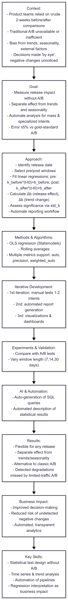

# Pre/Post Change Regression Test — Alternative to A/B Testing

---

## 🇬🇧 English version

**Timeline:** Q3 2025  
**Role:** Middle–Senior Data Analyst  
**Tech stack:** Python • pandas • NumPy • Statsmodels • Seaborn • Matplotlib • SQL (ClickHouse/PostgreSQL) • JupyterLab • Git  

### Context  
Product teams often relied on crude comparisons of 2 weeks before vs. 2 weeks after a release to measure the impact of updates (new scenarios, classifier improvements). Traditional A/B testing was unavailable or inefficient, leading to potential bias from trends, seasonality, or external factors. Decisions were often made “by eye,” and changes negatively affecting metrics could go unnoticed.

### Goal  
Develop a methodology and analytical tool to:  
- Measure release impact without A/B traffic splitting.  
- Separate effect from trends and seasonality.  
- Automate pre/post-release analysis for both mass and specialized intents.  
- Achieve an error ≤5% compared to gold-standard A/B tests.

### Approach  

**Data Pipeline & Regression Analysis**  
- Identify the release date (`date_of_change`).  
- Select analysis windows: N days before and after release.  
- Fit linear regressions for trends:  
  - Pre-release: k_before * (t - t0) + b_before  
  - Post-release: k_after * (t - t0) + b_after  
- Calculate:  
  - Δb = b_after - b_before — release effect  
  - Δk = k_after - k_before — trend change  
- Assess statistical significance via standard errors (`std_b`).  
- Automate reporting workflow for release analysis results.

**Methods & Algorithms**  
- OLS linear regression (Statsmodels) for pre/post trends.  
- Rolling averages to smooth noise.  
- Support multiple metrics (`auto`, `precision`, `weighted_auto`).  

**Iterative Development**  
- 1st iteration: manual tests on 1–2 intents.  
- 2nd iteration: automated report generation.  
- 3rd iteration: visualizations and consolidated dashboards.

**Experiments & Validation**  
- Compare results with available A/B tests.  
- Vary window lengths (7, 14, 30 days) to check stability.

**AI/Automation Tools**  
- Auto-generation of SQL queries for data extraction.  
- Automated description of statistical results.

**Evaluation Metrics**  
- Δb — release effect.  
- Δk — trend change.  
- p-value — statistical significance for b_before vs. b_after.

### Results  
- Flexible method applicable to any release, including mass updates.  
- Clear separation of effects from trends and seasonality.  
- High-quality alternative to traditional A/B testing.  
- Revealed system degradations missed by limited-traffic A/B tests.

### Business Impact  
- Improved decision-making on release effects.  
- Reduced risk of undetected negative changes.  
- Enabled automated, transparent analytics for product teams.

### Key Skills Highlighted  
- Statistical test design without A/B.  
- Time series and trend analysis.  
- Automation of analytics pipelines.  
- Interpretation of regression coefficients as business impact.

### Data Pipeline Visualization

---

## 🇷🇺 Русский вариант

**Сроки:** III квартал 2025  
**Роль:** Middle–Senior Data Analyst  
**Технологии:** Python • pandas • NumPy • Statsmodels • Seaborn • Matplotlib • SQL (ClickHouse/PostgreSQL) • JupyterLab • Git  

### Контекст  
Продуктовые команды часто использовали простое сравнение 2 недель до и после релиза для оценки влияния изменений (новые сценарии, улучшения классификатора). Классическое A/B-тестирование было недоступно или неэффективно, что приводило к возможной ошибке из-за трендов, сезонности или внешних факторов. Решения принимались «на глаз», а изменения, ухудшающие метрики, могли остаться незамеченными.

### Цель  
Разработать методологию и инструмент, позволяющий:  
- Измерять эффект релиза без разделения трафика на A/B.  
- Отделять эффект от трендов и сезонности.  
- Автоматизировать анализ до/после релиза для массовых и специализированных интентов.  
- Обеспечить ошибку ≤5% относительно эталонного A/B.

### Подход  

**Пайплайн данных и регрессионный анализ**  
- Определение даты релиза (`date_of_change`).  
- Выбор окна анализа: N дней до и после релиза.  
- Построение линейных регрессий:  
  - До релиза: k_before * (t - t0) + b_before  
  - После релиза: k_after * (t - t0) + b_after  
- Расчёт:  
  - Δb = b_after - b_before — эффект релиза  
  - Δk = k_after - k_before — изменение тренда  
- Проверка статистической значимости (стандартная ошибка `std_b`).  
- Автоматизация воркфлоу и отчетности.

**Методы и алгоритмы**  
- OLS линейная регрессия (Statsmodels) для трендов до/после.  
- Скользящее среднее для сглаживания шумов.  
- Поддержка нескольких метрик (`auto`, `precision`, `weighted_auto`).  

**Итеративная разработка**  
- 1-я итерация: ручное тестирование на 1–2 интентах.  
- 2-я итерация: автоматическая генерация отчетов.  
- 3-я итерация: визуализации и сводные дашборды.

**Эксперименты и проверка**  
- Сравнение с существующими A/B-тестами (где возможно).  
- Варьирование длины окна (7, 14, 30 дней) для проверки устойчивости.

**AI/Автоматизация**  
- Автогенерация SQL-запросов.  
- Автоматическое формирование описаний результатов.

**Метрики оценки**  
- Δb — эффект релиза.  
- Δk — изменение тренда.  
- p-value — статистическая значимость b_before и b_after.

### Результаты  
- Гибкий метод для любых релизов, включая массовые.  
- Чёткое отделение эффекта от трендов и сезонности.  
- Качественная альтернатива классическому A/B-тестированию.  
- Выявление системных деградаций, которые не фиксировались A/B при ограниченном трафике.

### Бизнес-эффект  
- Улучшение принятия решений по релизам.  
- Снижение риска незамеченных негативных изменений.  
- Автоматизация и прозрачность аналитики для продуктовых команд.

### Ключевые навыки  
- Построение статистических тестов без A/B.  
- Работа с временными рядами и трендовым анализом.  
- Автоматизация аналитических пайплайнов.  
- Интерпретация регрессионных коэффициентов как бизнес-эффекта.

### Визуализация пайплайна

