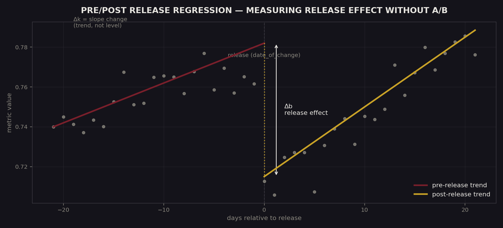

<p align="center">
  
</p>

<p align="right"><a href="README.md">English version →</a></p>

# Регрессионный тест до/после релиза — альтернатива A/B-тестированию


> **О коде.** Этот репозиторий описывает методологию, ключевые решения и результаты. Реализация является собственностью компании, в которой создавался проект, и не публикуется.

Статистический метод и автоматизированный пайплайн для измерения истинного эффекта релиза, когда разделение трафика на A/B-группы недоступно или нецелесообразно — отделяющий то, что реально изменилось, от тренда или сезонности, и сигнализирующий об этом автоматически, а не полагаясь на визуальную оценку графика.

## Кратко

| | |
|---|---|
| **Целевая точность** | ≤5% ошибки относительно эталонного A/B — достигнута на проверенных сравнениях |
| **Применимость** | любой релиз, от массовых изменений до точечных правок одного интента |
| **Проверка устойчивости** | подтверждена на окнах анализа 7 / 14 / 30 дней |
| **Статус** | спроектирован как переиспользуемая методология; сейчас активно не используется, поскольку процесс создания интентов, под который он был построен, был остановлен |

## Проблема

Продуктовые команды обычно сравнивали 2 недели до и 2 недели после релиза, чтобы оценить его влияние. Без полноценной контрольной группы такое сравнение уязвимо к тренду, сезонности и внешним факторам — релиз мог выглядеть как ухудшивший метрику, которая на самом деле уже снижалась и без него, или как улучшивший её, когда метрика просто восстанавливалась сама по себе. Решения часто принимались «на глаз», а негативные изменения могли остаться незамеченными.

## Подход

**Суть метода.** Для заданной даты релиза строятся две регрессии методом наименьших квадратов на временном ряде метрики — одна на окне до релиза, вторая на окне после:

```
до релиза:   k_before · (t - t0) + b_before
после релиза: k_after  · (t - t0) + b_after
```

Две производные величины разделяют то, что изменилось:

- **Δb = b_after − b_before** — эффект релиза: сдвиг уровня метрики непосредственно в момент релиза, независимо от уже существующего тренда.
- **Δk = k_after − k_before** — изменение тренда: изменил ли релиз саму *направленность* движения метрики, а не только её уровень.

Статистическая значимость обеих величин оценивается через стандартную ошибку подобранных коэффициентов — сдвиг засчитывается как реальный эффект только после прохождения порога значимости, а не просто потому, что две линии на графике визуально отличаются.

**Автоматизация.** SQL-запросы для выгрузки нужных окон метрики генерируются автоматически по каждому интенту, а описания результатов формируются автоматически из подобранных коэффициентов — аналитик проверяет и интерпретирует, а не собирает отчёт с нуля каждый раз.

**Валидация.** Точность метода проверялась на релизах, где также был доступен настоящий A/B-тест, а устойчивость — варьированием окна анализа (7, 14 и 30 дней), чтобы подтвердить, что оценённый эффект не является артефактом выбора окна.

**Итеративная разработка.** Построен в три этапа: ручная валидация на 1–2 интентах, затем автоматическая генерация отчётов, затем сводные визуализации и дашборды для более широкого использования.

## Результаты

- Достигнута целевая ошибка ≤5% относительно эталонного A/B-тестирования на проверенных релизах.
- Применим как к массовым релизам, так и к точечным изменениям одного интента — один и тот же метод масштабируется вниз без модификаций.
- Выявлял деградации, которые A/B-тесты с ограниченным трафиком пропускали, за счёт использования полного временного ряда до/после вместо выборки с разделением трафика.

## Влияние на бизнес

- Дал продуктовым командам способ оценивать эффект релиза даже там, где A/B-тестирование было невозможно, вместо визуальной оценки «на глаз».
- Снижен риск выкатить — и не заметить — релиз, который незаметно ухудшил метрику.
- Анализ релизов превращён из разовой ручной проверки в автоматизированный, повторяемый отчёт.

## Технологии

Python · pandas · NumPy · statsmodels (OLS) · Seaborn · Matplotlib · SQL

---

<sub>Индивидуальный проект в рамках роли Data Analytics. Описан здесь в портфолио-целях; продовый код не публикуется.</sub>
